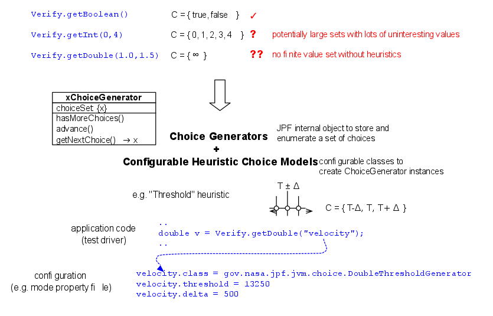
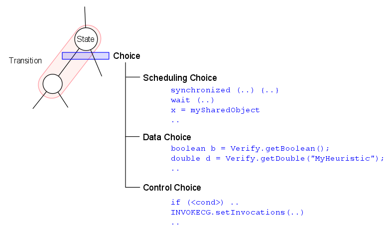
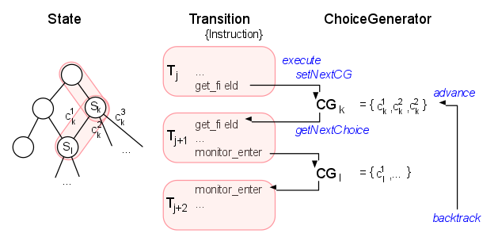
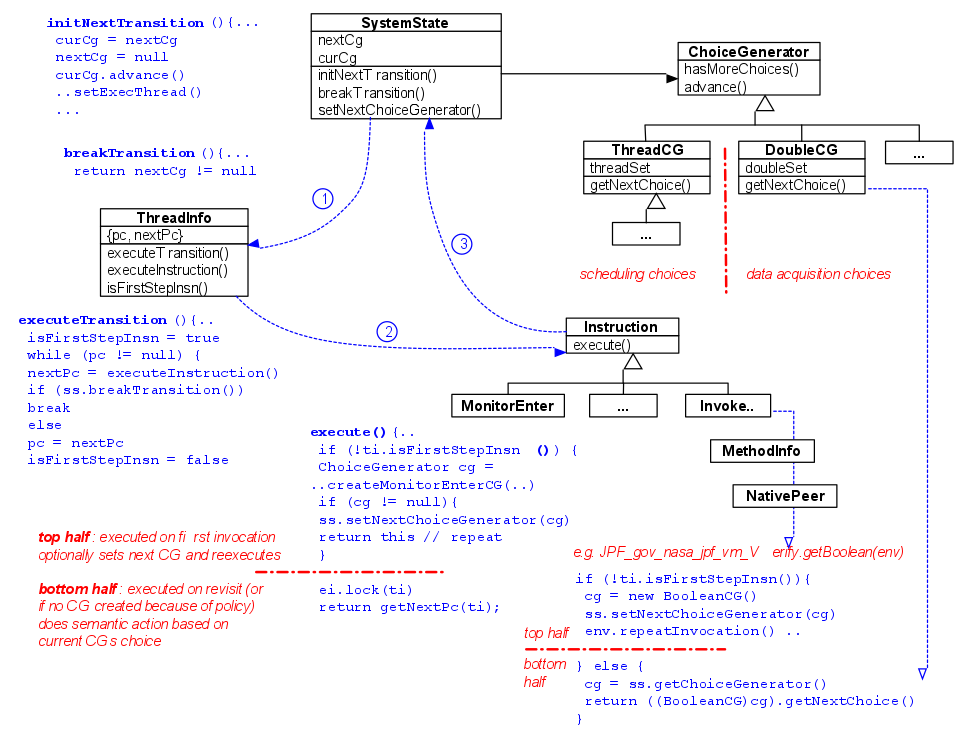

# ChoiceGenerators #

The goal of every model checker is to check if certain properties hold in states of the system under test. The way that choices are computed is a fundamental part of model checking, since they determine which states are checked. We refer to the mechanism used by JPF to capture choices as ChoiceGenerators.

ChoiceGenerators can be approached from an application perspective, or from the JPF implementation perspective. In this section, we cover both perspectives.

## Motivation ##

Whenever the model checker reaches non-determinism in code, it needs to compute choices. Non-determinism can be due to thread scheduling or non-deterministic data acquisitions. Here, we present an example including data non-determinism to justify our implementation approach. JPF provides support for "random" data acquisition, using the interface `gov.nasa.jpf.jvm.Verify`.

~~~~~~~~ {.java}
...
boolean b = Verify.getBoolean(); // evaluated by JPF for both `true` and `false`
...
~~~~~~~~

This worked nicely for small sets of choice values (such as `{true,false}` for boolean), but the mechanism for enumerating all choices from a type specific interval becomes already questionable for large intervals (e.g. `Verify.getInt(0,10000)`), and fails completely if the data type does not allow finite choice sets at all (such as floating point types):

{align=center width=750}

To handle this case, we have to leave the ideal world of model checking (that considers all possible choices), and make use of what we know about the real world - we have to use heuristics to make the set of choices finite and manageable. However, heuristics are application and domain specific, and it would be a bad idea to hardcode them into the test drivers we give JPF to analyze. This leads to a number of requirements for the JPF choice mechanism:

  * choice mechanisms have to be decoupled (i.e. thread choices should be independent of data choices, double choices from int choices etc.)
  * choice sets and enumeration should be encapsulated in dedicated, type specific objects. The VM should only know about the most basic types, and otherwise use a generic interface to obtain choices
  * selection of classes representing (domain specific) heuristics, and parametrization of ChoiceGenerator instances should be possible at runtime, i.e. via JPF's configuration mechanism (properties)

The diagram shown above depicts this with an example that uses a "randomly" chosen velocity value of type double. As an example heuristic we use a threshold model, i.e. we want to know how the system reacts below, at, and above a certain application specific value (threshold). We reduce an infinite set of choices to only three "interesting" ones. Of course, "interesting" is quite subjective, and we probably want to play with the values (delta, threshold, or even used heuristic) efficiently, without having to rebuild the application each time we run JPF.

The code example does not mention the used `ChoiceGenerator` class (`DoubleThresholdGenerator`) at all, it just specifies a symbolic name `"velocity"`, which JPF uses to look up an associated class name from its configuration data (initialized via property files or the command line - see Configuring JPF Runtime Options). But it doesn't stop there. Most heuristics need further parameterization (e.g. threshold, delta), and we provide that by passing the JPF configuration data into the `ChoiceGenerator` constructors (e.g. the `velocity.threshold` property). Each `ChoiceGenerator` instance knows its symbolic name (e.g. `"velocity"`), and can use this name to look up whatever parameters it needs.

## The JPF Perspective ##

Having such a mechanism is nice to avoid test driver modification. But it would be much nicer to consistently use the same mechanism not just for data acquisition choices, but also scheduling choices (i.e. functionality that is not controlled by the test application). JPF's ChoiceGenerator mechanism does just this, but in order to understand it from an implementation perspective we have to take one step back and look at some JPF terminology:

{align=center width=650}

*State* is a snapshot of the current execution status of the application (mostly thread and heap states), plus the execution history (path) that lead to this state. Every state has a unique id number. State is encapsulated in the `SystemState` instance (almost, there is some execution history which is just kept by the JVM object). This includes three components:

  * KernelState - the application snapshot (threads, heap)
  * trail - the last Transition (execution history)
  * current and next ChoiceGenerator - the objects encapsulating the choice enumeration that produces different transitions (but not necessarily new states)

*Transition* is the sequence of instructions that leads from one state to the next. There is no context switch within a transition, it's all in the same thread. There can be multiple transitions leading out of one state (but not necessarily to a new state).

*Choice* is what starts a new transition. This can be a different thread (i.e. scheduling choice), or different "random" data value.

In other words, possible existence of choices is what terminates the last transition, and selection of a choice value precludes the next transition. The first condition corresponds to creating a new `ChoiceGenerator`, and letting the `SystemState` know about it. The second condition means to query the next choice value from this `ChoiceGenerator` (either internally within the VM, or in an instruction or native method).

## How it comes to Life ##
With this terminology, we are ready to have a look at how it all works. Let's assume we are in a transition that executes a `getfield` bytecode instruction (remember, JPF executes Java bytecode), and the corresponding object that owns this field is shared between threads. For simplicity's sake, let's further assume there is no synchronization when accessing this object, (or we have turned off the property `vm.sync_detection`). Let's also assume there are other runnable threads at this point. Then we have a choice - the outcome of the execution might depend on the order in which we schedule threads, and hence access this field. There might be a data race.

{align=center width=550}

Consequently, when JPF executes this `getfield` instruction, the `gov.nasa.jpf.jvm.bytecode.GETFIELD.execute()` method does three things:

  1. create a new `ChoiceGenerator` (`ThreadChoiceGenerator` in this case), that has all runnable threads at this point as possible choices
  2. registers this `ChoiceGenerator` via calling `SystemState.setNextChoiceGenerator()`
  3. schedules itself for re-execution (just returns itself as the next instruction to execute within the currently running thread)

At this point, JPF ends this transition (which is basically a loop inside `ThreadInfo.executeStep()`), stores a snapshot of the current State, and then starts the next transition (let's ignore the search and possible backtracks for a moment). The `ChoiceGenerator` created and registered at the end of the previous transition becomes the new current `ChoiceGenerator`. Every state has exactly one current `ChoiceGenerator` object that is associated with it, and every transition has exactly one choice value of this `ChoiceGenerator` that kicks it off. Every transition ends in an instruction that produces the next `ChoiceGenerator`.

The new transition is started by the `SystemState` by setting the previously registered `ChoiceGenerator` as the current one, and calling its `ChoiceGenerator.advance()` method to position it on its next choice. Then the `SystemState` checks if the current `ChoiceGenerator` is a scheduling point (just a `ThreadChoiceGenerator` used to encapsulate threads scheduling), and if so, it gets the next thread to execute from it (i.e. the `SystemState` itself consumes the choice). Then it starts the next transition by calling `ThreadInfo.executeStep()` on it.

The `ThreadInfo.executeStep()` basically loops until an Instruction.execute() returns itself, i.e. has scheduled itself for re-execution with a new `ChoiceGenerator`. When a subsequent `ThreadInfo.executeStep()` re-executes this instruction (e.g. `GETFIELD.execute()`), the instruction notices that it is the first instruction in a new transition, and hence does not have to create a `ChoiceGenerator` but proceeds with it's normal operations.

If there is no next instruction, or the Search determines that the state has been seen before, the VM backtracks. The `SystemState` is restored to the old state, and checks for not-yet-explored choices of its associated ChoiceGenerator by calling `ChoiceGenerator.hasMoreChoices()`. If there are more choices, it positions the `ChoiceGenerator` on the next one by calling `ChoiceGenerator.advance()`. If all choices have been processed, the system backtracks again (until it's first `ChoiceGenerator` is done, at which point we terminate the search).

{align=center width=850}

The methods that create `ChoiceGenerators` have a particular structure, dividing their bodies into two parts:

  1. *top half* - (potentially) creates and registers a new `ChoiceGenerator`. This marks the end of a transition
  2. *bottom half* - which does the real work, and might depend on acquiring a new choice value. This is executed at the beginning of the next transition

To determine which branch you are in, you can call `ThreadInfo.isFirstStepInsn()`. This will return `true` if the currently executed instruction is the first one in the transition, which corresponds to the *bottom half* mentioned above.

The only difference between scheduling choices and data acquisition choices is that the first ones are handled internally by the VM (more specifically: used by the `SystemState` to determine the next thread to execute), and the data acquisition is handled in the bottom half of `Instruction.execute()`, native method, or listener callback method (in which case it has to acquire the current `ChoiceGenerator` from the `SystemState`, and then explicitly call `ChoiceGenerator.getNextChoice()` to obtain the choice value). For a real example, look at the `JPF.gov_nasa_jpf_jvm_Verify.getBoolean()` implementation.

As an implementation detail, creation of scheduling points are delegated to a `Scheduler` instance, which encapsulates a scheduling policy by providing a consistent set of `ThreadChoiceGenerators` for the fixed number of instructions that are scheduling relevant (`monitor_enter`, synchronized method calls, `Object.wait()` etc.). Clients of this `Scheduler` therefore have to be aware of that the policy object might not return a new `ChoiceGenerator`, in which case the client directly proceeds with the bottom half execution, and does not break the current transition.

The standard classes and interfaces for the ChoiceGenerator mechanism can be found in package `gov.nasa.jpf.vm`, and include:

  * `ChoiceGenerator`
  * `BooleanChoiceGenerator`
  * `IntChoiceGenerator`
  * `DoublechoiceGenerator`
  * `ThreadChoiceGenerator`
  * `SchedulingPoint`
  * `SchedulerFactory`
  * `DefaultSchedulerFactory`

Concrete implementations can be found in package `gov.nasa.jpf.vm.choice`, and include classes like:

  * `IntIntervalGenerator`
  * `IntChoiceFromSet`
  * `DoubleChoiceFromSet`
  * `DoubleThresholdGenerator`
  * `ThreadChoiceFromSet`

As the number of useful generic heuristics increases, we expect this package to be expanded.

## Cascaded ChoiceGenerators ##
There can be more than one `ChoiceGenerator` object associated with a transition. Such ChoiceGenerators are referred to as *cascaded*, since they give us a set of choice combinations for such transitions. 

For example, assume that we want to create a listener that perturbs certain field values, i.e. it replaces the result operand that is pushed by a `getfield` instruction. This is easy to do from a listener, but the VM (more specifically our on-the-fly [partial order reduction](partial_order_reduction)) might already create a `ThreadChoiceGenerator` (scheduling point) for this `getfield` if it refers to a shared object, and the instruction might cause a data race. Without cascaded `ChoiceGenerators` we could only have the perturbation listener **or** the race detection, but not both. This is clearly a limitation we want to overcome, since you might not even know when JPF - or some of the other [listeners](listener) or [bytecode_factories](bytecode_factory) - create `ChoiceGenerators` that would collide with the ones you want to create in your listener.

Using cascaded ChoiceGenerators requires little more than what we have already seen above. It only involves changes to two steps:

 1. ChoiceGenerator creation - you need to identify `ChoiceGenerators` with a `String` id. We can't use the type of the `ChoiceGenerator` - or it's associated choice type - to identify a particular instance, since different listeners might use different `ChoiceGenerator` instances of same types for different purposes. Resolving through unique types would throw us back to where we would have to know about all the other `ChoiceGenerators` created by all the other JPF components. We can't use the associated instruction either, because the whole point is that we can have more than one `ChoiceGenerator` for each of them. So we have to give our `ChoiceGenerator` instances names when we create them, as in
 
~~~~~~~~ {.java}
...
IntChoiceFromSet cg = new IntChoiceFromSet("fieldPerturbator", 42, 43);
~~~~~~~~

The name should be reasonably unique, describing the context in which this choice is used. Don't go with "generic" names like "myChoice". In case of doubt, use the method name that creates the `ChoiceGenerator`. The reason why we need the *id* in the first place is that we later-on want to be able to retrieve a specific instance. Which brings us to:

 2. ChoiceGenerator retrieval - at some point we want to process the choice (usually within the *bottom half* of the method that created the `ChoiceGenerator`), so we need to tell JPF all we know about the `ChoiceGenerator` instance, namely id and type. The simple `SystemState.getChoiceGenerator()` we used above will only give us the last registered one, which might or might not be the one we registered ourselves. Retrieval is done with a new method `SystemState.getCurrentChoiceGenerator(id,cgType)`, which in the above case would look like:
 
~~~~~~~~ {.java}
...
IntChoiceFromSet cg = systemState.getCurrentChoiceGenerator("fieldPerturbator", IntChoiceFromSet.class);
assert cg != null : "required IntChoiceGenerator not found";
...
~~~~~~~~

This method returns `null` if there is no `ChoiceGenerator` of the specified id and type associated with the currently executed instruction. If this is the bottom half of a method that created the instance, this is most likely an error condition that should be checked with an assertion. If the retrieval is in another method, existence of such a `ChoiceGenerator` instance could be optional and you therefore have it checked in an `if (cg != null) {..}' expression.

This is all there is to it in case you don't refer to a particular execution state of an instruction. As an example, assume that you want to add some int choices on top of each `Verify.getInt(..)` call. Your listener would look like this:

~~~~~~~~ {.java}
  @Override
  public void instructionExecuted(VM vm, ThreadInfo ti, Instruction nextInsn, Instruction executedInsn) {
    SystemState ss = vm.getSystemState();

    if (executedInsn instanceof EXECUTENATIVE) { // break on method call
      EXECUTENATIVE exec = (EXECUTENATIVE) executedInsn;

      if (exec.getExecutedMethodName().equals("getInt")){ // Verify.getInt(..) - this insn did create a CG on its own
        if (!ti.isFirstStepInsn()){ // top half - first execution
          IntIntervalGenerator cg = new IntIntervalGenerator("instrumentVerifyGetInt", 3,4);
          ss.setNextChoiceGenerator(cg);
          ...

        } else { // bottom half - re-execution at the beginning of the next transition
          IntIntervalGenerator cg = ss.getCurrentChoiceGenerator("instrumentVerifyGetInt", IntIntervalGenerator.class);
          assert cg != null : "no 'instrumentVerifyGetInt' IntIntervalGenerator found";
          int myChoice = cg.getNextChoice();
          ... // process choice
        }
      }
    }
  }
~~~~~~~~

Sometimes what you do with your choice depends on the execution state of the instruction this `ChoiceGenerator` was created for, and you have to be aware of that the instruction might get re-executed (e.g. after processing the top half of another `ChoiceGenerator` creating method) before it has done what you depend on for your local choice processing. Consider our previous example of the field perturbation. Simply speaking, all we want to do in our listener is just swap operand stack values after a certain `getfield`. However, the partial order reduction of the VM might get in our way because it reschedules the instruction *before* it pushes the value if execution of this instruction might constitute a data race, and therefore required creation of a `ThreadChoiceGenerator` instance. What is worse is that the VM might do this conditionally - if there is only one runnable thread, there is no need for a scheduling point since there can't be a data race. Our own perturbator listener has to account for all that. Luckily, we can use `SystemState.getCurrentChoiceGenerator(id,type)` to unify all these cases, and we just have to restore execution state in case we want to re-execute the instruction ourselves. Here is an example:

~~~~~~~~ {.java}
  @Override
  public void instructionExecuted(VM vm, ThreadInfo ti, Instruction nextInsn, Instruction executedInsn) {
    SystemState ss = vm.getSystemState();

    if (executedInsn instanceof GETFIELD){
      GETFIELD getInsn = (GETFIELD) executedInsn;
      FieldInfo fi = getInsn.getFieldInfo();
      if (fi.getName().equals("perturbedFieldName")){

        IntChoiceFromSet cg = ss.getCurrentChoiceGenerator("fieldReplace", IntChoiceFromSet.class);
        StackFrame frame = ti.getModifiableTopFrame();
        if (cg == null){

          // we might get here after a preceding rescheduling exec, i.e.
          // partial execution (with successive re-execution), or after
          // non-rescheduling exec has been completed (only one runnable thread).
          // In the first case we have to restore the operand stack so that
          // we can re-execute
          if (!ti.willReExecuteInstruction()){
            // restore old operand stack contents
            frame.pop();
            frame.push(getInsn.getLastThis());
          }

          cg = new IntChoiceFromSet("fieldReplace", 42, 43);
          ss.setNextChoiceGenerator(cg);
          ti.reExecuteInstruction();

        } else {
          int v = cg.getNextChoice();
          int n = frame.pop();
          frame.push(v);
        }
      }
    }
  }
~~~~~~~~

These examples show you that at the beginning of each transition, there is a choice value for all the cascaded `ChoiceGenerators` associated with it. If you would add `choiceGeneratorAdvanced()` notifications to your listener, you would also see that JPF processes all related choice combinations.

If you really want to see the context, there are a number of additional methods in `SystemState` that might help you:

 * `getChoiceGenerator()` - returns only the last registered one
 * `getChoiceGenerators()` - returns an array of all `ChoiceGenerators` in the current execution path
 * `getLastChoiceGeneratorOfType(cgType)` - returns the last registered `ChoiceGenerator` in the path that is of the specified type
 * `getCurrentChoiceGenerators()` - returns array of all cascaded `ChoiceGenerators` associated with the current transition
 * `getCurrentChoiceGenerator(id)` - returns last registered `ChoiceGenerator` of cascade with specified *id*
 * `getCurrentChoiceGenerator(id,cgType)` - our workhorse: last registered `ChoiceGenerator` of cascade with specified *id* and *cgType* (which can be a supertype of the actual one)
 * etc.

How does the system detect if a `ChoiceGenerator` is cascaded or not? Very simple - within `SystemState.setNextChoiceGenerator(cg)`, we just check if `SystemState` already had a registered next `ChoiceGenerator`, and if so, we set a cascaded attribute for this one. Other than that, we just maintain normal linear `ChoiceGenerator` linkage, which is accessible through `ChoiceGenerator.getPreviousChoiceGenerator()`. If you want to iterate through a cascade yourself, use the `ChoiceGenerator.getCascadedParent()` method, which returns `null` if there is none. Just be aware of that the last registered `ChoiceGenerator` (i.e. what `SystemState.getChoiceGenerator()` returns) does *not* have the cascaded attribute set (i.e. `ChoiceGenerator.isCascaded()` returns `false`).    